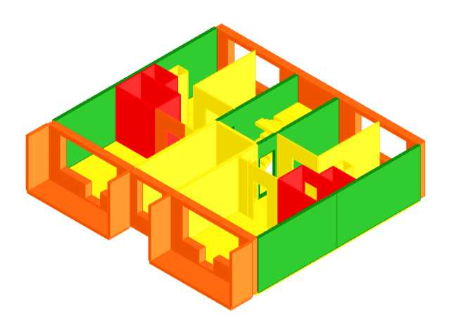

<div align="center">
# circular-gh-ifc-ai
 
**LLM-assisted semantic enrichment of IFC data for circular reuse of large-panel building systems**
 
***Filling the gaps in forgotten buildings***
 
[%20115397-orange)](https://doi.org/10.1016/j.jobe.2026.115397)
[](https://creativecommons.org/licenses/by-nc/4.0/)
[
[](https://creativecommons.org/licenses/by-nc/4.0/)
[](#citing)
[](LICENSE)
[](LICENSE-DATA)
[](https://www.rhino3d.com/)
[](https://geometrygym.com/)
[](#what-this-is-and-what-it-is-not)
 
</div>

**Supplementary material for:**
Płoszaj-Mazurek, M., & Tofiluk, A. (2026). *A workflow for LLM-assisted IFC data enrichment to support circular reuse of large-panel building systems in Poland.* **Journal of Building Engineering, 120, 115397.**
https://doi.org/10.1016/j.jobe.2026.115397 (open access, CC BY-NC 4.0)
 
This repository contains the proof-of-concept Grasshopper definition and the example BIM/IFC models used in Section 6.1 ("Applying algorithms to circularity in design") and Figures 5–6 of the paper.
 

 
*Colour-coded circularity index per element — green = high reuse potential, red = low.*
 
---
 
## What this is (and what it is not)
 
**Is:** an experimental, reproducible demonstrator showing that (a) circularity-relevant attributes can be read from and written back to an IFC model inside a parametric environment, (b) missing attributes can be completed by a combination of lookup tables and LLM inference, and (c) the enriched dataset can drive a normalised element-level circularity score and a colour-coded 3D visualisation.
 
**Is not:** a validated or industry-ready assessment tool. As stated in Sections 7–8 of the paper, the circularity indicator is provisional, LLM-inferred attributes were checked by expert review rather than against ground-truth archival or in-situ data, and no error ranges or sensitivity analysis were computed. Outputs must not be used as a basis for structural, safety, or certification decisions.
 
---
 
## Repository contents
 
| File | Description |
| --- | --- |
| `gh-ai-script.gh` | Grasshopper definition: IFC parsing, data-completeness check, LLM enrichment call, circularity scoring, colour-coded visualisation, CSV/JSON export. |
| `example-ifc.ifc` | Example IFC export of one apartment module (Szczecin system, Sz-s) used as input to the script. |
| `example-revit.rvt` | Source Revit model, including the *Circularity Information* shared-parameter group described in Appendix B, Table B2. |
| `docs/assets/` | Example-output image used in this README. |
| `LICENSE` | MIT licence (code). |
| `LICENSE-DATA` | CC BY 4.0 licence (example models and documentation). |
| `CITATION.cff` | Machine-readable citation metadata. |
 
---
 
## Requirements
 
| Component | Version used | Notes |
| --- | --- | --- |
| Rhinoceros 3D + Grasshopper | *TODO: Rhino 7 / Rhino 8* | The `.gh` file was authored in this version; older versions may not open it. |
| Geometry Gym (`ggRhinoIFC`) | *TODO: version* | Required to open IFC files inside Grasshopper. https://geometrygym.com |
| Python component | *TODO: GhPython (IronPython 2.7) or Rhino 8 Python 3* | Custom scripts parse IFC property sets and call the LLM API. |
| Autodesk Revit | *TODO: version* | Only needed to open `example-revit.rvt`; the workflow itself starts from IFC. |
| OpenAI API key | GPT-4 family model | Any chat-completions-compatible endpoint can be substituted. |
 
---
 
## Quick start
 
1. Install Rhino/Grasshopper and the Geometry Gym IFC plugin.
2. Clone or download this repository.
3. Set your API key as an environment variable (do **not** paste it into the definition and do not commit it):
```powershell
   # Windows, current user, persists across sessions
   setx OPENAI_API_KEY "sk-..."
```
 
   Restart Rhino after setting the variable so it is picked up by the Python component.
4. Open `gh-ai-script.gh`.
5. Point the IFC file-path parameter at `example-ifc.ifc` (or your own IFC export).
6. Toggle the enrichment switch to send the flagged gaps to the LLM.
7. Inspect the colour-coded preview and the panel output; use the export component to write CSV/JSON.
 
> **Cost and reproducibility warning.** Each enrichment run issues live API calls, which cost money and are non-deterministic — repeated runs on identical input can return different values. Review every enriched value before use.
 
---
 
## Workflow (as implemented)
 
```
Step 0  BIM inventory prepared in Revit; circularity shared parameters added
Step 1  IFC exported and parsed in Grasshopper (Geometry Gym + Python)
Step 2  Missing / ambiguous attributes flagged (data-completeness check)
Step 3  Enrichment — (a) deterministic lookup tables, (b) LLM inference for the remainder
Step 4  Circularity index (0–100, normalised to 0–1) inferred per element
Step 5  Colour-coded 3D feedback in Grasshopper + CSV/JSON export; optional write-back to IFC
```
 
Corresponds to Fig. 6 in the paper. Note that the score is produced holistically by the LLM from a structured prompt rather than by an explicit weighted aggregation — the relative weight of each attribute is implicit in the model's reasoning, not specified by the authors. See Section 6.1 and Appendix B, Table B4.
 
---
 
## Regenerating the example
 
The example IFC was exported from `example-revit.rvt` with the *Circularity Information* parameter group mapped to IFC property sets. If you re-export, make sure the mapping is preserved — otherwise the script will flag every circularity attribute as missing and hand the entire model to the LLM.
 
To use your own model: replicate the shared-parameter group listed in `docs/circularity-parameters.md`, export to IFC, and swap the file path.
 
---
 
## Known limitations
 
- Single prefabrication system (Szczecin / Sz-s); other LPS types are untested.
- One IFC file tested; no benchmarking across a corpus of models.
- No quantitative error analysis of LLM outputs; plausible-but-wrong values are possible, especially near reuse decision thresholds.
- Grasshopper-only; no interoperability testing with LCA software or digital-twin platforms.
- `Pset_CircularityAssessment` is used here as a working convention, not a standardised buildingSMART property set.
---
 
## Citing
 
If you use this material, please cite the article:
 
```bibtex
@article{PloszajMazurek2026,
  author  = {P{\l}oszaj-Mazurek, Mateusz and Tofiluk, Anna},
  title   = {A workflow for {LLM}-assisted {IFC} data enrichment to support
             circular reuse of large-panel building systems in {Poland}},
  journal = {Journal of Building Engineering},
  volume  = {120},
  pages   = {115397},
  year    = {2026},
  doi     = {10.1016/j.jobe.2026.115397}
}
```

To cite this repository specifically — for example when referring to the exact code state used — cite the archived Zenodo deposit:
 
```bibtex
@software{PloszajMazurek2026software,
  author    = {P{\l}oszaj-Mazurek, Mateusz and Tofiluk, Anna},
  title     = {circular-gh-ifc-ai: Grasshopper workflow for {LLM}-assisted {IFC}
               data enrichment},
  version   = {v1.0.0},
  publisher = {Zenodo},
  year      = {2026},
  doi       = {10.5281/zenodo.21970016},
  url       = {https://doi.org/10.5281/zenodo.21970016}
}
```
 
---
 
## Licence
 
- **Code and Grasshopper definition:** MIT (see `LICENSE`).
- **Example models (`example-ifc.ifc`, `example-revit.rvt`) and documentation:** CC BY 4.0 (see `LICENSE-DATA`) — reuse freely with attribution to the article above.
- **The article itself:** CC BY-NC 4.0, © 2026 the authors, published by Elsevier Ltd.
## Funding
 
Research funded by Warsaw University of Technology under the Excellence Initiative: Research University (IDUB) programme.
 
## Contact
 
Mateusz Płoszaj-Mazurek — mateusz.mazurek@pw.edu.pl
Faculty of Architecture, Warsaw University of Technology
 
Issues and pull requests are welcome, but note that this repository archives the state of a published proof-of-concept; substantive changes to the method will not be merged.
 
